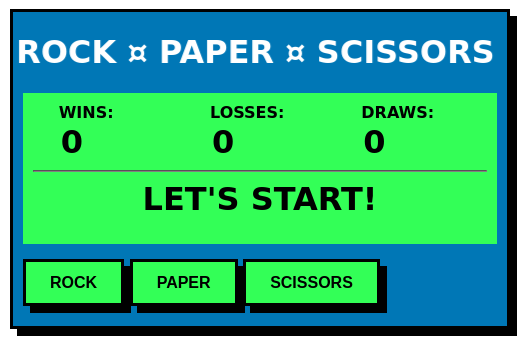

# Project 02 - Rock Paper Scissors

## Basic functionality

Game is played against the computer that returns a random choice.
- [x] Function *getComputerChoice* randomly returns “rock”, “paper” or “scissors” using *Math.random*.
- [x] A simple interface enables user to pick from one of the three options.
- [x] Function *playRound* compares return values of *getComputerChoice* and *getHumanChoice* and updates the score.
- [x] A screen informs the user what were the choices and who won the round. 
- [x] Game concludes after 5 rounds and asks user if they want to play again.   

## Extra credits

## Tech stack

- HTML
- CSS
- Javascript

## Live demo & version

v1.10
No demo currently.