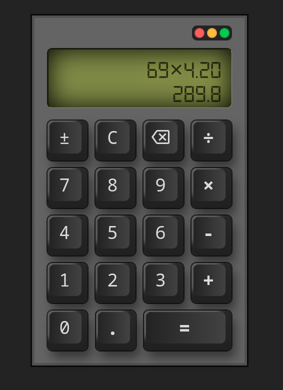

# Project 05 - Calculator

## Basic functionality

I've created a simple calculator with following functions triggered by pressing the button on the keyboard:
- Add numbers to the screen,
- Add an operator (+, -, ×, ÷),
- Produce a new value by using two numbers and an operator,
- Delete last character,
- Insert a floating point,
- Change a number to positive/negative,
- Clear the screen.

## Tech stack

- HTML
- CSS
- Javascript

## Extra credits

- [x] Add a "." button and let users input decimals!
- [x] Add a “backspace” button, so the user can undo if they click the wrong number.
- [] Add keyboard support.

## Live demo & version
v1.00
No demo currently.
