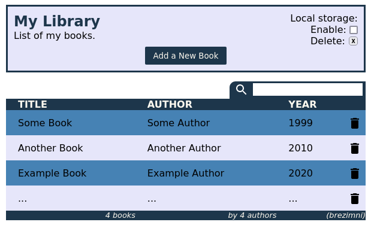

# Project 01 - Library

## Basic functionality

The goal was to creat a simple library app.
- [x] All of the book objects are stored in array.
- [x] User can add new book by pressing "ADD A NEW BOOK" button and entering it's details.
- [x] Each entry has a delete button that allows user to remove it.
- [ ] Each entry should have a "READ" status and a button to change it.

## Extra credits
- [x] The utilizes local storage and has a button that allows deleteting local data.
- [ ] The table can be sorted by pressing column header tag.
- [x] The table has a search bar that allows user to filter the contents.
- [ ] Add a button that allows user to edit individual entries.

## Tech stack

- HTML
- CSS
- Javascript

## Live demo & version
v1.00
No demo currently.