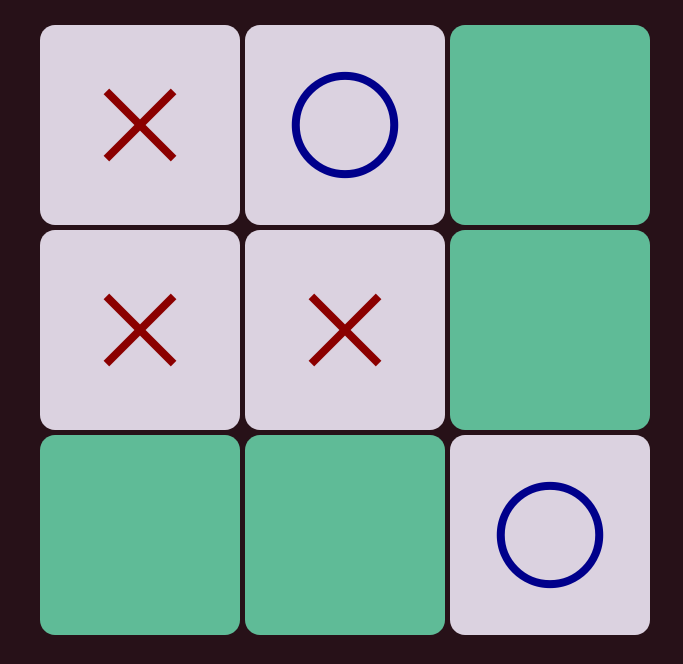

# Project 02 - Tic-tac-toe

## Basic functionality

The goal was to creat a simple game of tic-tac-toe.
- [x] Create a 3x3 grid that the user can interact with.
- [x] The game has two players one represented by X and the other by O signs.
- [x] There are no global vatiables except for game object that has an exposed method startNewGame which allows user to reset the game board.
- [ ] Allow users to input their names before the start of each game.
- [ ] Announce the result at the end of the game and allow the user to restart the game.

## Extra credits
- [ ] There's a scoreboard on the side that keeps track of different players and game scores.
- [ ] Add an option to play agaist a "computer player".
- [x] Modularize javascript end adhere to the concept of pure functions.

## Tech stack

- HTML
- CSS
- Javascript

## Live demo & version
v1.00
No demo currently.